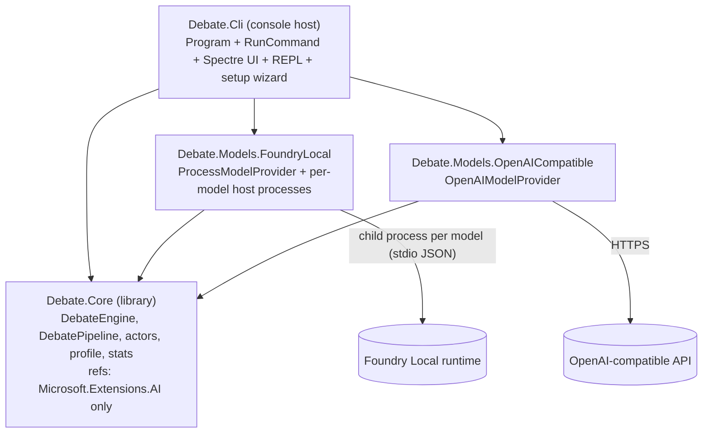
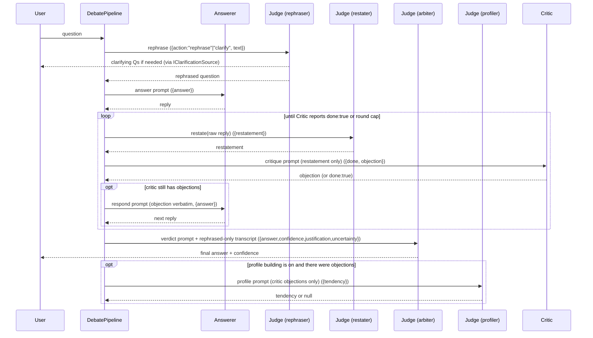

# Architecture

A short tour of the code. For *why* the system is shaped this way (the design rationale, references, known issues), see [design.md](design.md).

This is the C# / .NET implementation. The original Python version is preserved under [old-python-src/](old-python-src); the algorithm is identical, only the runtime and infrastructure differ.

## Solution layout

```
.
├── README.md
├── design.md              # design rationale, references, known issues
├── architecture.md        # this file: code map and extension points
├── testing.md             # benchmark prompts and how to compare configurations
├── old-python-src/        # the original Python (Ollama) implementation
└── src/
    ├── Debate.slnx
    ├── personas/                          # one .txt per (preset, token); Judge split into 4 single-job contexts
    ├── Debate.Core/                       # the algorithm + abstractions (no UI, no backend)
    ├── Debate.Models.FoundryLocal/        # local backend (Foundry Local)
    ├── Debate.Models.OpenAICompatible/    # remote backend (OpenAI-compatible)
    ├── Debate.Cli/                        # console host (Spectre.Console) + appsettings.json
    └── Debate.Tests/                      # xUnit tests over Debate.Core
```

## High-level shape

`Debate.Core` is a **UI- and backend-agnostic library**. It holds the entire debate algorithm and reaches models only through `Microsoft.Extensions.AI`'s `IChatClient` abstraction. Its only other package dependency is `Microsoft.ML.Tokenizers` (plus the cl100k_base data), used by the token counter. It never references Foundry, OpenAI, the console, or Spectre. The same library could drive a GUI or web frontend with no changes.

Two seams keep it decoupled:

- **Models** flow in through `IModelProvider`, which hands the algorithm an `IChatClient` per `DebateRole`. Whether that client is a local Foundry model or a cloud endpoint is invisible to the algorithm.
- **User interaction** flows out through `IDebateObserver` (output events) and `IClarificationSource` (async input for the rephrase loop). The host implements these.

A backend may additionally implement the optional capabilities in `[IBackendCapabilities.cs](src/Debate.Core/IBackendCapabilities.cs)` — `IPrefetchable` (a warm-up step for `--prefetch`) and `IBackendDiagnostics` (the process list shown by `!stats`). The host tests for these interfaces rather than for a concrete backend type, so a new backend opts in without the CLI knowing it exists.



The host (`Debate.Cli`) picks a provider from configuration, builds a .NET Generic Host (DI + options + the Foundry bootstrap as an `IHostedService`), runs the setup wizard, constructs a `DebateEngine`, and drives the REPL.

## Modules

| Module | Role |
| --- | --- |
| `[src/Debate.Core/IModelProvider.cs](src/Debate.Core/IModelProvider.cs)` | The seam: role -> `IChatClient` + model name + context size. |
| `[src/Debate.Core/IDebateObserver.cs](src/Debate.Core/IDebateObserver.cs)`, `[IClarificationSource.cs](src/Debate.Core/IClarificationSource.cs)` | Host-implemented output/input seams. Keep the core console-free. |
| `[src/Debate.Core/DebateEngine.cs](src/Debate.Core/DebateEngine.cs)` | Public façade: `RunQuestionAsync`, `ClearSessionAsync`, `GetStatsSnapshot`, `GetPersonaInfo`, `GetActorContexts`. |
| `[src/Debate.Core/DebatePipeline.cs](src/Debate.Core/DebatePipeline.cs)` | The per-question state machine (rephrase, debate, verdict, profile note). Every actor exchange is a JSON contract (see `DebatePrompts`/`JsonProtocol`); a reply that fails to parse triggers one automatic re-ask. |
| `[src/Debate.Core/DebatePrompts.cs](src/Debate.Core/DebatePrompts.cs)` | The per-phase user prompts; each states the exact JSON shape expected back. Public so `!context` can display them. |
| `[src/Debate.Core/JsonProtocol.cs](src/Debate.Core/JsonProtocol.cs)` | Reply DTOs and a tolerant `TryParse<T>` (strips reasoning tags, isolates the outermost `{...}` span, salvages non-string values) so the pipeline never depends on exact-string formatting. |
| `[src/Debate.Core/DebateContext.cs](src/Debate.Core/DebateContext.cs)` | Shared session state (history, profile, actors) and the `RecordProfileNote` merge logic. |
| `[src/Debate.Core/Actors/](src/Debate.Core/Actors)` | `Actor` base + `Answerer`/`Critic` and the four Judge contexts (`JudgeRephraser`/`JudgeRestater`/`JudgeArbiter`/`JudgeProfiler`, all routed to the Judge model). Hold their own `ChatMessage` history; temperature applied per call via `ChatOptions`. |
| `[src/Debate.Core/Profile.cs](src/Debate.Core/Profile.cs)` | Similarity scoring, stylistic-note filter, thresholds. |
| `[src/Debate.Core/SessionStats.cs](src/Debate.Core/SessionStats.cs)` | Per-session counters and token buckets. |
| `[src/Debate.Core/TiktokenCounter.cs](src/Debate.Core/TiktokenCounter.cs)` | Token counting via `Microsoft.ML.Tokenizers` (cl100k_base) with a heuristic fallback. |
| `[src/Debate.Core/PersonaLibrary.cs](src/Debate.Core/PersonaLibrary.cs)` | Persona file lookup and placeholder rendering. |
| `[src/Debate.Models.FoundryLocal/](src/Debate.Models.FoundryLocal)` | `ProcessModelProvider`: runs each role's model in its own child process (`FoundryModelHost`, re-invoking this exe with `__serve-model`) and talks to it over a stdin/stdout JSON protocol; `FoundryModelLoader` handles EP registration and variant selection. Per-profile `ExecutionMode` controls residency: `Parallel` (all resident), `Sequential` (one at a time, kill-to-unload), or `SemiSequential` (Judge pinned, others cycle). Models are warmed on a background task at startup (Judge first) so the REPL is interactive immediately; a request for a not-yet-loaded model starts/awaits it on demand. Per-profile `MaxOutputTokens` caps generation per role (carried to the host via the stdin/stdout protocol). |
| `[src/Debate.Models.OpenAICompatible/](src/Debate.Models.OpenAICompatible)` | `OpenAIModelProvider`: per-role `IChatClient` over any OpenAI-compatible endpoint. |
| `[src/Debate.Cli/](src/Debate.Cli)` | Console host: `Program`/`RunCommand`, the Spectre observer + clarification source, the setup wizard, and the REPL commands. |
| `[src/personas/](src/personas)` | Persona text files: `<preset>.<token>.txt` (Judge split into rephraser/restater/arbiter/profiler). |

## Per-question flow

A more detailed step-by-step lives in [design.md](design.md). The short version (unchanged from the original):



Key invariants enforced by the pipeline (`[DebatePipeline.cs](src/Debate.Core/DebatePipeline.cs)`):

- The Judge is split into four single-job contexts (rephraser, restater, arbiter, profiler), each with its own conversation buffer routed to the Judge model. **Per question** (`ResetPerQuestion`, not per debate round), all four — and the Critic — are invalidated and rebuilt so their system prompts reflect the latest session state. The Answerer keeps its memory.
- The **rephraser** never sees the debate; its system prompt carries the prior rephrased questions paired with their verdicts (`{prior_exchanges}`), so follow-up questions stay consistent. That history is capped at the most recent `DebateContext.MaxPriorExchanges` questions, with each stored verdict abbreviated, so a long session cannot crowd the current question out of the context window.
- The **restater** is the only context that ever ingests the raw Answerer text. The Critic only ever receives its restatement.
- The Answerer hears critiques verbatim.
- The **arbiter** rules on the debate in rephrased form only: restatements paired with the Critic's objections, round by round. The Answerer's rebuttal to an objection reaches it as the next round's restatement, never as raw text.
- The **profiler**'s only input is the list of Critic objections; it is skipped entirely when there were none.
- Each context is handed exactly one task per message and replies in JSON; it never pre-judges. There are no magic strings in the model output — replies are parsed into typed DTOs, with one re-ask on a parse failure.

## Extending and configuring

### Add a new `!command`

Commands live in `[src/Debate.Cli/Commands/](src/Debate.Cli/Commands)`. A command is a `ReplCommand` subclass with a `Name`, a `Help`, and `ExecuteAsync`. Register it in `[ChatLoop.cs](src/Debate.Cli/ChatLoop.cs)` and the REPL dispatches by name.

### Change the models

No code changes are needed; edit `[appsettings.json](src/Debate.Cli/appsettings.json)`. The two backends are shaped differently: the local provider defines named **profiles** (`Debate:FoundryLocal:Profiles:<name>`), each a complete role lineup plus its device and residency settings, selected by `Debate:FoundryLocal:Profile` or `--profile`; the remote provider has a single `Debate:Remote:Models` map.

Keep `Judge != Answerer` and `Critic != Answerer` model families (see [design.md](design.md) for why). Note that a same-vendor remote lineup only partially satisfies this: distinct OpenAI models are still more familiar to each other than to a Mistral or Qwen model.

Aliases are resolved (and downloaded) when a model host actually starts, which for the default `SemiSequential` mode means only the Judge is resolved at startup — a mistyped Answerer or Critic alias surfaces when the debate first reaches that role, not before. Run `--prefetch` to force every model in the active profile to load once.

### Use a remote / cloud model

Set `Debate:Provider` to `Remote` (or pass `--provider Remote`), set `Debate:Remote:Endpoint`, and supply the API key via the `Debate:Remote:ApiKeyEnvVar` environment variable. Because every actor reaches the model only through `IModelProvider` -> `IChatClient`, no algorithm code changes.

### Add a new backend

Implement `IModelProvider` in a new project that references `Debate.Core`, add a `services.Add...Provider(...)` extension, and wire it into the provider switch in `[RunCommand.cs](src/Debate.Cli/RunCommand.cs)`. If the backend needs async startup (like Foundry's model download), also implement `IHostedService`. Implement `IPrefetchable` and/or `IBackendDiagnostics` to join `--prefetch` and the `!stats` process table; both are optional and the host degrades gracefully without them. The actors, pipeline, engine, and REPL need no edits.

### Change how questions are processed (the debate pipeline)

All round-level orchestration is in `[DebatePipeline.cs](src/Debate.Core/DebatePipeline.cs)`. The safe knobs are the round cap (`SessionConfig.MaxRounds`, set from `Debate:Defaults:MaxRounds`, the wizard, or `--rounds`), the retry budgets at the top of the class (`MaxRephraseNudges`, `MaxAnswererClarifications`), and the per-phase prompt templates in `[DebatePrompts.cs](src/Debate.Core/DebatePrompts.cs)`. If you change a prompt's JSON shape, update its reply DTO in `[JsonProtocol.cs](src/Debate.Core/JsonProtocol.cs)` to match.

To add, remove, or reorder a phase, subclass `DebatePipeline` and override the phase you want to change: the phase methods are `protected virtual`, and `DebateEngine` accepts a factory so a host can supply the subclass.

### Add or edit a persona

Personas live in `[src/personas/](src/personas)` as `<name>.<token>.txt` and are copied to the CLI output directory at build. The Answerer and Critic use one file each (`answerer`, `critic`), but the Judge is split into four single-job contexts, each with its own file and its own conversation buffer: `judge-rephraser`, `judge-restater`, `judge-arbiter`, `judge-profiler` (the canonical token list is `PersonaTokens`). Placeholders substituted at render time: `{prior_exchanges}` (rephraser — prior rephrased questions paired with their verdicts), `{prior_rephrased}` (Critic), `{answerer_profile}` (Critic only), and `{no_think}` (any persona), which becomes the Qwen3 `/no_think` switch when that role's model is a Qwen and is removed otherwise. Never hardcode `/no_think` into a persona file: on other families it is an unexplained command token, which invites exactly the non-JSON preamble it exists to suppress. Personas describe the role only and must instruct JSON-only replies; the concrete task and JSON shape for each phase come from `DebatePrompts`, not the persona. Use `!context` to inspect exactly what each actor receives.

### Output formatting

All console output goes through `[SpectreDebateObserver.cs](src/Debate.Cli/SpectreDebateObserver.cs)` and input through `[ConsoleClarificationSource.cs](src/Debate.Cli/ConsoleClarificationSource.cs)`. Redirecting to a file, a GUI, or a web frontend is a matter of implementing `IDebateObserver` / `IClarificationSource` elsewhere.

## Tests

`[src/Debate.Tests/](src/Debate.Tests)` is an xUnit suite over `Debate.Core`. Run it with `dotnet test Debate.slnx` from `src/`.

Most of it drives the real `DebateEngine` with scripted `IChatClient`s (`Support/Scenario.cs`) over temporary persona files, then asserts on each actor's actual conversation buffer — so the context-isolation invariants listed above are executable checks, not just prose. Scripted replies are routed by prompt content (`Support/Phase.cs`) rather than call order, which is what keeps the four Judge contexts apart when they share one client.

The backend projects are not covered: everything under `Debate.Models.*` is verified by reading and by manual runs.

## What is *not* here

- No persistence. Sessions live in process memory.
- No structured logging or telemetry beyond the standard .NET logging.
- No evaluation of answer quality. `!stats` measures cost and context usage, not whether the verdict was right; see [testing.md](testing.md).
