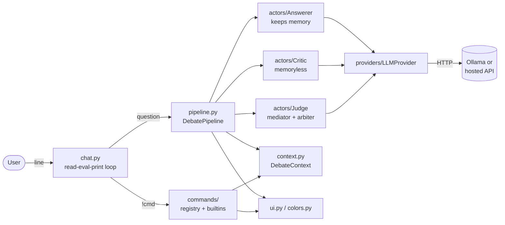
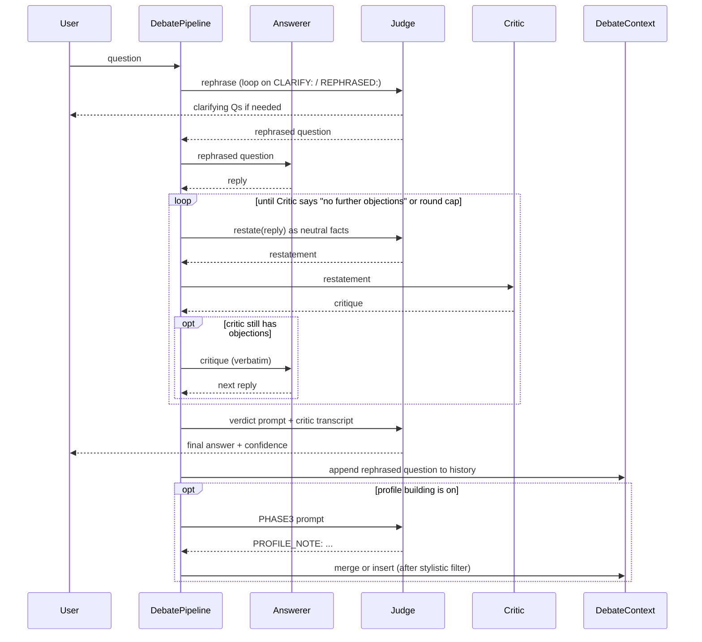

# Architecture

A short tour of the code. For *why* the system is shaped this way (the design rationale, references, known issues), see [design.md](design.md).

## Project layout

```
.
├── README.md          # quick start, prerequisites, install
├── LICENSE
├── design.md          # design rationale, references, known issues
├── architecture.md    # this file: code map and extension points
└── src/
    ├── debate.py          # entry point, wires provider + actors + chat loop
    ├── requirements.txt
    ├── install.ps1
    ├── personas/          # one .txt per (preset, role)
    └── debate_pkg/
        ├── chat.py        # interactive read-eval-print loop
        ├── pipeline.py    # the per-question state machine
        ├── context.py     # shared session state
        ├── setup.py       # interactive setup wizard
        ├── personas.py    # persona file loading
        ├── profile.py     # cross-round Answerer profile
        ├── tokens.py      # token counting helpers
        ├── ui.py          # all print/input lives here
        ├── colors.py
        ├── actors/        # Answerer, Critic, Judge, SystemActor
        ├── commands/      # !help, !new, !personas, !stats
        └── providers/     # LLMProvider interface + OllamaProvider
```

## High-level shape

`debate.py` is a thin entry point. It picks an `LLMProvider`, runs the setup wizard, builds a `DebateContext` plus the three actors, and hands control to the chat loop. The chat loop dispatches `!commands` and otherwise forwards each line to the `DebatePipeline`, which is the single place that knows how a question is turned into a verdict.




## Modules


| Module                                                                                  | Role                                                                                                                       |
| --------------------------------------------------------------------------------------- | -------------------------------------------------------------------------------------------------------------------------- |
| `[src/debate.py](src/debate.py)`                                                        | Entry point. Picks the concrete provider and wires everything together.                                                    |
| `[src/debate_pkg/chat.py](src/debate_pkg/chat.py)`                                      | Read-eval-print loop. Dispatches commands, forwards everything else to the pipeline.                                       |
| `[src/debate_pkg/pipeline.py](src/debate_pkg/pipeline.py)`                              | `DebatePipeline`: per-question state machine (rephrase, debate, verdict, profile note). All round-level prompts live here. |
| `[src/debate_pkg/context.py](src/debate_pkg/context.py)`                                | `DebateContext`: shared session state (history, profile, references to actors) and `record_profile_note` merge logic.      |
| `[src/debate_pkg/setup.py](src/debate_pkg/setup.py)`                                    | Interactive setup wizard. Returns a `SessionConfig`.                                                                       |
| `[src/debate_pkg/personas.py](src/debate_pkg/personas.py)`                              | Persona file lookup and template placeholder rendering.                                                                    |
| `[src/debate_pkg/profile.py](src/debate_pkg/profile.py)`                                | `ProfileEntry`, similarity scoring, stylistic-note filter, thresholds.                                                     |
| `[src/debate_pkg/tokens.py](src/debate_pkg/tokens.py)`                                  | Token counting for `!stats`.                                                                                               |
| `[src/debate_pkg/ui.py](src/debate_pkg/ui.py)`, `[colors.py](src/debate_pkg/colors.py)` | All `print()` / `input()` and ANSI colouring. The only file that talks to the terminal.                                    |
| `[src/debate_pkg/actors/](src/debate_pkg/actors)`                                       | `Actor` base + `Answerer`, `Critic`, `Judge`, `SystemActor`.                                                               |
| `[src/debate_pkg/commands/](src/debate_pkg/commands)`                                   | `Command` pattern, registry, and the built-in commands.                                                                    |
| `[src/debate_pkg/providers/](src/debate_pkg/providers)`                                 | `LLMProvider` interface and the `OllamaProvider` implementation.                                                           |
| `[src/personas/](src/personas)`                                                         | Persona text files: `<preset>.<role>.txt`.                                                                                 |


## Per-question flow

A more detailed step-by-step lives in [design.md](design.md) ("A single question, end to end" and the sequence diagram). The short version:




Key invariants enforced by the pipeline (see `[pipeline.py](src/debate_pkg/pipeline.py)`):

- Per round, the Judge and Critic are invalidated and rebuilt so their system prompts reflect the latest history and profile. The Answerer keeps its memory.
- The Critic only ever receives Judge restatements. It never sees raw Answerer text.
- The Answerer hears critiques verbatim.
- The Judge receives the Critic's challenges only at the verdict step, as part of the verdict prompt.

## Extending and configuring

The codebase is small and tries to keep each concern in one place. Use this section as the entry point when you want to change something.

### Add a new `!command`

Commands live in `[src/debate_pkg/commands/](src/debate_pkg/commands)`. A command is a `Command` subclass with a `name`, a `help`, and an `async execute(ctx, args)` that returns a `CommandResult`. To add one, drop a new class in `[commands/builtins.py](src/debate_pkg/commands/builtins.py)` (or a new module in the same package) and register it in `register_builtins(registry)`. The chat loop dispatches by name automatically. Example skeleton:

```python
from .base import Command, CommandResult
from ..ui import print_info

class HelloCommand(Command):
    name = "hello"
    help = "say hello"

    async def execute(self, ctx, args):
        print_info(f"hello {args or 'world'}")
        return CommandResult()

def register_builtins(registry):
    ...
    registry.register(HelloCommand())
```

### Change the local models

The role -> model mapping is in exactly one place: the `MODELS` dict in `[providers/ollama.py](src/debate_pkg/providers/ollama.py)`:

```python
MODELS = {
    "answerer": "llama3.1:8b",
    "critic":   "qwen2.5:7b",
    "judge":    "llama3.1:8b",
}
```

Change the tags, `ollama pull` the new ones, done. The deliberate use of two different model families for Answerer and Critic is not arbitrary - it dampens the homogeneous-MAD echo-chamber effect discussed in [design.md](design.md).

### Use a hosted / cloud model (OpenAI, Anthropic, Azure, ...)

Every other module talks to the LLM backend only through the abstract `LLMProvider` in `[providers/base.py](src/debate_pkg/providers/base.py)`. Swapping in a hosted backend is three small steps and `debate.py` is the only file that names a concrete provider.

**Step 1.** Add a new subclass under `[src/debate_pkg/providers/](src/debate_pkg/providers)`. Below is a complete, working example for hosted OpenAI. Save it as `[src/debate_pkg/providers/openai_cloud.py](src/debate_pkg/providers/openai_cloud.py)`:

```python
"""Hosted OpenAI backend. Reads OPENAI_API_KEY from the environment."""

import os

from autogen_ext.models.openai import OpenAIChatCompletionClient

from .base import LLMProvider
from ..ui import print_error


class OpenAICloudProvider(LLMProvider):
    # One place to pick which model plays which role. The Critic deliberately
    # uses a different family from the Answerer to avoid echo-chamber effects.
    MODELS = {
        "answerer": "gpt-4o-mini",
        "critic":   "claude-style-via-openai-or-anything-different",  # see note below
        "judge":    "gpt-4o",
    }

    # All gpt-4o family models share a 128k context window.
    CONTEXT_SIZE = 128_000

    def bootstrap(self):
        if not os.environ.get("OPENAI_API_KEY"):
            print_error("OPENAI_API_KEY is not set in the environment.")
            return False
        return True

    def make_client(self, role, temperature):
        return OpenAIChatCompletionClient(
            model=self.MODELS[role],
            api_key=os.environ["OPENAI_API_KEY"],
            temperature=temperature,
        )

    def model_for(self, role):
        return self.MODELS[role]

    def effective_context_size(self):
        return self.CONTEXT_SIZE
```

The `MODELS` placeholder above is illustrative. In practice you would use two real model names (e.g. `gpt-4o-mini` for Answerer and Judge, something genuinely different for the Critic such as a Claude or Gemini model via their respective `autogen_ext` clients). If you actually want a different vendor for one role, use a different `make_client` branch per role and import the relevant client (`AzureOpenAIChatCompletionClient`, `AnthropicChatCompletionClient`, etc.).

**Step 2.** Export the new provider from `[providers/__init__.py](src/debate_pkg/providers/__init__.py)`:

```python
from .base import LLMProvider
from .ollama import OllamaProvider
from .openai_cloud import OpenAICloudProvider

__all__ = ["LLMProvider", "OllamaProvider", "OpenAICloudProvider"]
```

**Step 3.** Swap the one line in `[src/debate.py](src/debate.py)` that picks the provider:

```python
# from debate_pkg.providers import OllamaProvider
# provider = OllamaProvider()

from debate_pkg.providers import OpenAICloudProvider
provider = OpenAICloudProvider()
```

That is the whole change. The actors, the pipeline, the chat loop and the commands are all backend-agnostic and need no edits. Run with the API key set in your shell:

```bash
export OPENAI_API_KEY=sk-...
python debate.py
```

For Azure OpenAI use `AzureOpenAIChatCompletionClient` from `autogen_ext.models.openai` and supply `azure_endpoint` and `api_version`. For Anthropic, use the corresponding `autogen_ext` client. The provider shape stays the same; only the import and the constructor arguments inside `make_client` change.

### Change how questions are processed (the debate pipeline)

All round-level orchestration is in `[pipeline.py](src/debate_pkg/pipeline.py)`. The safe knobs are constants at module scope:

- `MAX_DEBATE_ROUNDS` - hard cap on Answerer <-> Critic exchanges.
- `MAX_REPHRASE_NUDGES` - how many times the Judge gets nudged to use `CLARIFY:` / `REPHRASED:` before the question is aborted.
- `CRITIC_DONE_MARKER` - the substring the Critic uses to signal "no further objections".
- `RESTATE_PROMPT_TEMPLATE`, `VERDICT_PROMPT_TEMPLATE`, `PHASE3_PROMPT` - the prompts driving the Judge's three out-of-band steps.

For larger changes (e.g. structured restatement, multiple critics), subclass `DebatePipeline` and override the protected methods rather than editing the actor classes - the actors are intentionally dumb.

### Add or edit a persona

Personas live in `[src/personas/](src/personas)` as plain text files following the pattern `<name>.<role>.txt`. Each role file is the system prompt for that actor under that persona. Two placeholders are substituted at render time by `[personas.py](src/debate_pkg/personas.py)`:

- `{prior_rephrased}` (Critic, Judge) - numbered list of past rephrased questions in the session.
- `{answerer_profile}` (Critic only) - active Answerer-tendency notes (only those observed at least twice).

A persona preset is "available" if all three role files exist, or if the missing ones can fall back to the corresponding `default.<role>.txt`. To add a new preset, create the three files and it will show up in the setup wizard's list automatically.

### Output formatting

All `print()` and `input()` go through `[ui.py](src/debate_pkg/ui.py)` with colour helpers in `[colors.py](src/debate_pkg/colors.py)`. Redirecting output to a file, a structured log, or a future GUI is a single-file change.

## What is *not* here

- No persistence. Sessions live in process memory; closing the CLI drops everything.
- No structured logging or telemetry.
- No tests. As noted in the README, this is a toy project.

