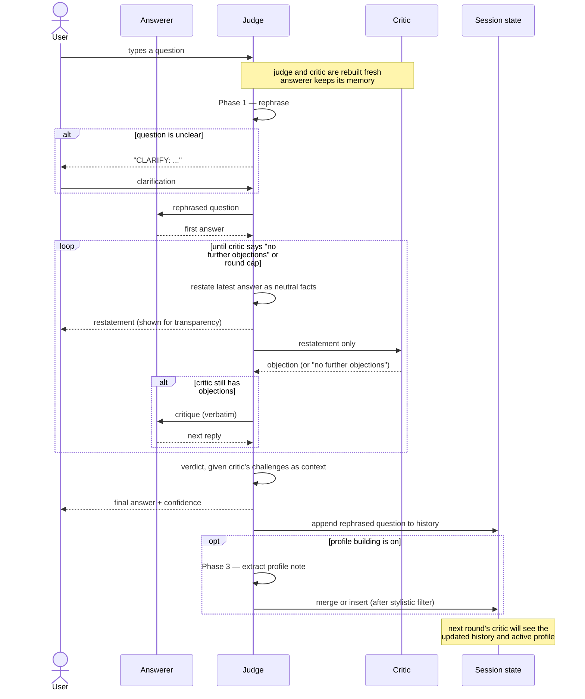

# Multi-Agent Debate: Under the hood

## What this is

An interactive CLI that turns each user question into a small structured debate between three LLM "actors". Instead of asking one model for an answer, the system pits a confident answerer against a sceptical critic and lets an impartial judge run the show and deliver the verdict.

As a mental model for the flow: thesis (the answerer proposes), antithesis (the critic pushes back), synthesis (the judge weighs the exchange and rules). Mechanically it is a Multi-Agent Debate (MAD) setup in the lineage of Du et al. [1] and Liang et al. [11], a practical cousin of the older "AI safety via debate" idea [2], and it stops at the judge's verdict rather than iterating forever.

Three design choices give it character:

- The user's question is never sent verbatim to the debate. A judge first **rephrases** it into a neutral, precise form (and may ask the user to clarify before doing so). Everyone debates that rephrased version. The point is to defuse sycophancy [3, 4] at the entry point, so the answerer never sees the leading framing the user may have typed. Rewriting prompts to neutralise them is not new (it shows up under different names in the sycophancy and judge-bias literature [8, 9, 20]); what is specific here is doing it **before** the debate starts, not as a post-hoc evaluation trick.
- The judge sits between the answerer and the critic as a **one-way information bottleneck**. After every answerer reply, the judge restates it as neutral facts (stripped of rhetoric, hedging, and persuasive framing), and that restatement is the *only* thing the critic ever sees. The answerer hears the critic raw; the critic only ever hears the answerer through the judge.
- The judge quietly **builds a profile of the answerer's recurring weaknesses** across rounds, and that profile is fed into the critic's instructions on later rounds so the critic knows where to probe harder.

## The three actors

### Answerer

- Tries to answer the rephrased question directly and concisely.
- Concedes when the critic is right and explains what changed; defends when the critic is wrong.
- Cannot rely on its own past replies as shared knowledge, because the critic is fresh every round and hasn't seen them.
- Must not invent sources; admits ignorance instead.

### Critic

- Does not answer the question. Its job is to stress-test the answerer, like a structured Devil's Advocate.
- Re-phrases the question differently to see if the answer still holds, argues the strongest opposing position, flags unsupported claims or weak reasoning, surfaces hidden assumptions.
- One specific trick it is told to use is **negation-as-inversion**: take any claim X and force itself to argue "what if not X?". The point is that hidden assumptions are easier to spot in their negated form ("we should use microservices" vs. "what if we did not use microservices?"). This is a runtime version of the classic "consider the opposite" debiasing strategy from the cognitive-bias literature [21].
- Adversarial but fair, with no manufactured objections. Says "No further objections" when genuinely done.
- **Never sees the answerer's words directly.** Every answerer reply reaches it as a neutral restatement produced by the judge, so the critic challenges substance, not style.
- **Memoryless across rounds.** A fresh critic is built for every question. This is deliberate: it prevents critic-fatigue, prevents the answerer from "training" the critic into politeness through earlier turns, and avoids the conformity drift documented in homogeneous MAD setups [10, 11]. The only cross-round signal it gets is the rephrased-question history and the answerer profile.

### Judge

- The orchestrator and ultimate arbiter. Plays three roles, on purpose. The judge is both an **LLM-as-a-Judge** [5] (issuing the verdict) and, at the debate-level, a **Meta-Judge** in the sense of Ma et al. [6] (mediating, normalising, and ruling on the exchange, not just scoring it).
- Runs three phases for every question:
  - **Phase 1 — rephrase.** Decides whether the question is clear enough. If yes, emits the rephrased version; if no, asks the user a focused clarifying question and loops until ready. Rewriting the question into a neutral technical tone is the first line of defence against the imitation/sycophancy bias [3, 4], essentially doing at inference time what others have tried to fix at training time [20].
  - **Phase 2 — mediate and verdict.** Mediates the debate by restating each answerer reply as neutral facts before the critic ever sees it (the bottleneck). At the end, given the critic's challenges as context, delivers the final answer in plain language with a low/medium/high confidence label and a note of any unresolved uncertainty.
  - **Phase 3 — profile note.** After the debate, produces at most one tentative observation about the answerer (e.g. "he might tend to over-generalise from a single example"), or "none". Only substantive tendencies that the critic actually criticised count; stylistic complaints (length, tone, formatting, emoji…) are off-limits.
- Knows the list of previously rephrased questions so it can keep scope and terminology consistent and recognise when the user is referring back to an earlier topic.

## A single question, end to end

1. **Setup.** The judge and critic are dropped and rebuilt so their instructions can pick up the latest debate history and answerer profile. The answerer is left alone and keeps its memory.
2. **Rephrase.** The judge either rewrites the question into a neutral form or starts a clarification dialogue with the user. The clarification loop continues until the judge is satisfied or the user abandons the question.
3. **Debate.** The answerer takes the rephrased question and replies. Then a bounded loop runs:
  - the judge restates the latest answerer reply as neutral facts;
  - the critic sees only that restatement and either raises an objection or says "no further objections";
  - if the critic isn't done, the answerer hears the critique directly and replies again, and the loop continues.
   The loop ends when the critic declares it's done or after a hard ceiling on rounds.
4. **Verdict.** The judge (which has every answerer reply in its memory but has not seen the critic) is given the critic's challenges as context and produces the final answer, confidence label, and any remaining uncertainty.
5. **Bookkeeping.** The rephrased question is appended to the session history.
6. **Profile update.** If profile-building is enabled, the judge is asked once more for a profile note. The note is run through the rules below (similarity merge, stylistic filter, surfacing threshold) and either bumps an existing entry or starts a new candidate.

## Memory model: what persists, what resets

What survives between rounds:

- **The answerer's conversation memory.** It remembers every debate it took part in, including its own past answers and the critic's past objections.
- **The list of rephrased questions so far.** Used by the critic and the judge to stay consistent with earlier terminology and scope.
- **The answerer profile.** Both the active entries (visible to the critic) and the pending candidates (still being corroborated).

What is dropped at the start of every question:

- **The critic and the judge themselves.** They're rebuilt from scratch so their freshly rendered instructions reflect the latest history and profile. The critic never carries memory of past debates; the judge carries its own within-round memory (clarifications it asked, restatements it produced, the verdict it issued, the profile note it extracted) but that memory does not persist across rounds.

What each actor sees inside one round:

- **The answerer** sees the rephrased question, then every critic reply, verbatim.
- **The critic** sees only judge restatements, never the answerer's actual words.
- **The judge** sees every answerer reply (as input to its restate prompts) and is handed the critic's challenges at the end as context for the verdict.

## What goes into the history (and what doesn't)

- **Rephrased questions** are stored as a numbered list and shown to the critic and the judge as context.
- **Full debate transcripts** are not stored anywhere shared. The answerer remembers its own debates; nobody else does.
- **User clarification replies** during Phase 1 stay inside that one round; they are not added to the history.
- **The judge's neutral restatements** are shown to the user alongside the raw answerer reply, on purpose: drift between the two (claims that quietly disappear, get softened, or get distorted in the restatement) is then visible to the human in real time. It is also not persisted across rounds.
- **The verdict** is not stored as a structured artefact either. The answerer carries it as part of its own conversation memory, which is how continuity feels natural in follow-up questions.

## The Answerer profile

The profile is the system's only cross-round learning mechanism. Its rules are intentionally conservative so that one bad-tempered round can't poison later ones.

- **Source.** Only the judge can write to it, and only when the critic raised a real, substantive criticism during the debate. The judge phrases entries tentatively ("he might tend to…").
- **Stylistic filter.** Notes about length, formatting, tone, voice, emoji, punctuation, headings, and similar surface concerns are rejected outright. The profile is about *what* the answerer reasons poorly about, not *how* it writes.
- **Deduplication.** A new note is compared against existing entries by simple word overlap. If it's close enough to an existing entry, that entry's observation count is bumped instead of adding a duplicate.
- **Surfacing threshold.** A note has to be observed at least twice before it becomes visible to the critic. Single-shot observations stay hidden as pending candidates, on the assumption that one occurrence might be noise.
- **Capacity.** The candidate list is bounded. When it's full and a new distinct note arrives, the oldest single-occurrence candidate is evicted first; corroborated entries are protected.
- **Effect on the next round.** Active entries are listed in the critic's instructions as "observed answerer tendencies: probe these with extra care".

## High-level sequence of one round




## Why it's designed this way: research lineage

The pieces are not arbitrary. Each one is there to kill a specific failure mode that the recent literature on multi-agent LLM systems has flagged.

Model-critiques-model loops have been around since at least Constitutional AI [17] and the self-critiquing models work [19]; LLM-as-a-Judge with explicit awareness of its own biases is well covered [5, 8, 16]; paraphrase-based debiasing and per-agent profile state are not new either.

### Restatement as an extractive paraphrase

The judge's per-turn restatement is the most opinionated part of the design. Two ideas are behind it:

- **The "lossy paraphrase" intuition.** Tishby's information bottleneck principle [7] is the classic framing for "compress an input to just what's useful for a downstream task". We borrow the *intuition* (there's a useful trade-off between keeping the claims and dropping the rhetorical surface) and nothing more. We are not training anything; the judge is a prompted paraphraser, not a learned encoder, and calling it an "information bottleneck" in the design discussion is shorthand. Think of it as an extractive paraphraser whose job is to keep the *what* and drop the *how it was said*.
- **A mediator, not a blind reviewer.** It is tempting to call this "double-blind review". It isn't. Double-blind review hides author *identity*; reviewers still read the original prose. What this system does is closer to a court mediator or a Wikipedia-style neutral rewrite: each side's claims are restated in a uniform voice before the other side ever sees them, so identity *and* voice are normalised. The reason this matters in practice: LLM judges and critics have been shown to favour or reject answers partly because of the *writing style* of the producing model, not the content [8, 9, 16]. Paraphrasing as a debiasing trick has been studied directly in the LLM-as-Judge setting [8]. By pushing every answerer-to-critic message through the judge's rewrite, the goal is simple: the critic argues with the claim, not the prose.

One important caveat the literature flags [8]: stylistic rewriting helps but is not a magic fix. Authorship can still leak through deeper patterns (perplexity, word choice, structure) that survive paraphrasing. So treat the bottleneck as *useful*, not *bulletproof*. It also pushes a lot of responsibility onto the judge's faithfulness as a restater (the game-of-telephone risk below).

### Why the critic is memoryless

Recent work on MAD failure modes [6, 10, 11] keeps reaching the same conclusion: when the agents share training data and accumulate shared context, the "debate" stops being adversarial and turns into an **echo chamber**. The usual suspects are sycophantic conformity (a stronger model drifts toward a weaker peer's wrong answer instead of pushing back [10]), contextual fragility (a correct answer gets nudged off by a peer's bad reasoning), and degeneration of thought (the variety the debate was supposed to produce flattens out across rounds [11]). Naive MAD can therefore *amplify* biases rather than correct them [10, 11]. Wiping the critic between rounds is the cheapest defence: it never builds up "we agreed last time" inertia, can't be slowly trained into politeness, and won't echo a position it took on an earlier question.

### Why a single judge (a Meta-Judge), not a panel

Ma et al. [6] compared multi-agent debate against Meta-Judge setups for LLM evaluation and found that MAD-as-Judge amplifies the usual judge biases (position, verbosity, chain-of-thought-length, bandwagon) badly after the first round, while a Meta-Judge structure holds up much better. Those underlying biases (position, verbosity, self-enhancement) are themselves well documented [5, 16]. One judge with explicit procedural duties is the closest match to the resilient setup Ma et al. describe. The verdict prompt deliberately only reaches the judge at the end, with the critic's challenges handed over as context, not thrown into a free-for-all chat as a peer voice.

There is a related strand of work where a (possibly weaker) judge supervises stronger debating experts [2, 12, 13]. Khan et al. [12] show that adversarial debate between LLMs can improve truthfulness even when the judge is weaker than the debaters, with the important footnote that the result is sensitive to how well-calibrated the judge is. That is reassuring for this design, but it does not transfer cleanly here; see *Known issues* below.

One deliberate twist on the usual Meta-Judge framing: in [6] (and most LLM-as-Judge work) the meta-judge scores a debate that has *already finished*. Here the judge is in the loop on every turn (mediator, restater, and finally arbiter), and the whole thing is an interactive chat with a human, not benchmark scoring. So the same architectural lever (Meta-Judge resistance to bias amplification) is being asked to also do runtime mediation, which is more demanding.

### Why the answerer profile, and why it's stylistic-free

The profile is the only thing the system carries across rounds. The broader idea (giving an agent stack an explicit, structured view of who each agent is and how it tends to fail) already exists in the persona-driven agent-simulation literature. The answerer profile flips that around: instead of seeding the answerer with a personality, the system *learns* the answerer's actual weak spots as it goes and feeds that knowledge to the critic. The loop "critic probes under a rubric, judge arbitrates and updates the rubric" is essentially a runtime cousin of Constitutional AI [17], except the rubric is grown from observed behaviour rather than written upfront. The stylistic filter is the seatbelt: without it the profile would quickly degenerate into "this model writes long bulleted answers", which is true but useless to a critic.

## Trade-offs

- **The judge becomes a single point of failure.** If the judge mis-restates, the critic ends up arguing with a strawman. It's the LLM version of the kids' game of telephone, and that is exactly what the side-by-side raw-reply / restatement display is meant to expose to the user.
- **Latency and token cost.** One round now costs (answer) + (restate) + (critique) + eventually (verdict). On local models this is annoying; on hosted APIs it is a real bill. We don't measure the gap against single-agent self-critique baselines like Self-Refine [18], and that gap is often small in the literature, so the extra cost has to be earned by the bottleneck and the profile.

## Things to try next

A few directions that follow naturally from the current shape.

- **Structured restatement to fight drift.** The judge's restatement is free-form prose right now, which is exactly where telephone-game errors creep in. A simple hardening is to make the judge emit a structured object instead, e.g.
  ```json
  {
    "core_claims": ["...", "..."],
    "assumptions": ["..."],
    "omitted_variables": ["..."],
    "evidence_offered": ["..."]
  }
  ```
  The critic would then receive this structure instead of prose. That makes "what is being claimed" auditable and makes drift between turns easy to detect mechanically: a claim that just disappears between turn N and turn N+1 is a clear flag.
- **Split the judge into Mediator and Arbiter personas.** The current single prompted persona has to neutralise (rephrase), preserve information (restate), and arbitrate under conflict (verdict) all at once. Driving the same model through two specialised prompts (a Mediator for the within-round rephrase + restate work and an Arbiter for the end-of-round verdict) relieves the worst objective conflict at near-zero implementation cost. It does not affect the Meta-Judge property from [6], which is about how many *models* contribute to the decision, not how many prompts a single model is driven through.
- **Neuro-symbolic verification on top of the structured restatement.** Once the restatement is structured, you can go one step further and have the judge emit a small logical fragment (first-order logic or Prolog clauses with preconditions and assumptions) that an actual solver can check. The recent neuro-symbolic line of work (LINC, FLARE, Proof of Thought, THOUGHT-LIKE-PRO [14]) shows the pattern is practical: the LLM does the parsing into a formal representation, an external prover does the deduction. Inside this debate the obvious target is consistency-checking: do the answerer's claims, together with the critic objections it conceded, actually fit together?
- **Multiple critics with different roles.** A "literature critic" (probes citations and factual claims), a "logic critic" (probes derivations), and an "edge-case critic" (probes preconditions) would extend the negation-as-inversion idea into a small specialised panel, without losing the Meta-Judge protection against echo-chamber effects, because the critics still never see each other directly.
- **Calibrated confidence.** The current low/medium/high verdict label is just a prompted self-report. A useful upgrade is to calibrate it against the actual track record (using the cross-round profile data) so "high confidence" actually means something across a session.
- **Single-shot CoT mode as a built-in baseline.** Add a one-model, one-pass, no-critique chat agent (plain chain-of-thought) as a runtime mode of the same CLI, so that the cost / accuracy comparison in [testing.md](testing.md) can include it as a true floor row alongside DAB and Self-Refine. Without that floor, a DAB-vs-Self-Refine delta cannot separate "MAD helps" from "any critique loop helps".

## Known issues

These are structural problems that follow from the design choices above. They are not bugs to fix (yet) but limits the user should be aware of when reading a verdict.

### The judge does three jobs with different optimization pressures

The judge is asked to rephrase the question, restate every answerer turn as neutral facts, and finally issue the verdict. Those three jobs have quite different objectives (neutralisation, information preservation, and decisive arbitration under conflict), and fusing them into one prompted persona assumes the model is faithful in all three modes simultaneously. Worse, the judge writes the very surface (the restatement) that the verdict is then evaluated against: every answerer turn reaches the verdict only through the judge's own paraphrase. Structurally this is closer to a self-evaluation loop than to mediation, and it inherits self-preference bias [8]: even when the judge "is not told" who wrote what, perplexity-based familiarity cues can leak through and tilt the verdict toward outputs that match the judge's own style profile.

A second-order failure: if the judge is the weakest model in the trio (the realistic case if cost matters), it fails first at the *restatement* step. Weak compressors silently drop technical claims, and the critic then critiques strawmen. The Khan et al. [12] result that a weaker judge can still extract truth from stronger debaters does *not* transfer cleanly here, because that result assumes the judge is purely arbitrating, not also writing the surface the critic sees. The side-by-side raw/restatement display detects this only if the human reads both carefully and is competent enough to spot the drift, which partially defeats the purpose of running the system instead of asking the user directly.

The system has no internal mechanism to detect that the judge itself is the binding constraint, and no recovery path when it is.

### Default models are smaller than the literature assumes

The whole bottleneck story assumes the judge can faithfully restate the answerer's reply as neutral facts. On the default 7–8B Ollama models (`llama3.1:8b`, `qwen2.5:7b`) this is the most likely point of first failure: abstractive paraphrase at this size class routinely drops technical claims and softens hedges, so the critic systematically ends up arguing with a strawman rather than occasionally. The defaults are what they are because local hardware in the 16 GB range cannot comfortably run larger models, not because they were chosen as the best vehicle for this design (see also *Things to try next*).

A direct consequence: numbers produced by this CLI on the default backend are not directly comparable to the multi-agent / Meta-Judge literature cited above, which evaluates on GPT-4-class judges and debaters. Quantitative claims about whether the bottleneck and the profile "pay for themselves" should be re-validated against a stronger backend.

### The cross-round profile is a mutation vector

The profile is the only persistent learning signal, and it is **judge-write-only and judge-read-only** (the judge writes notes; the critic reads them via the rendered instructions). The answerer has no rebuttal channel into it. If the judge mis-identifies a tendency, the next critic systematically probes a phantom weakness, the answerer over-defends, the judge registers further "confirmations", and the profile self-reinforces. The observed-twice surfacing threshold and the capacity-bounded LRU on single-observation candidates are necessary but not sufficient: both observations originate from the same judge under the same biases, so they are not independent samples.

In practice this means a weak or biased judge degrades the profile in a way that compounds across rounds, and because the surfacing threshold then hardens the bad note, the next critic is *more* confidently wrong than the last. The system has no internal mechanism to detect that the profile has drifted, and no recovery path that does not involve manual intervention.

## References

[1] Du, Y., Li, S., Torralba, A., Tenenbaum, J. B., & Mordatch, I. (2023). *Improving Factuality and Reasoning in Language Models through Multiagent Debate.* arXiv:2305.14325. The landmark MAD paper. Society-of-Mind framing.

[2] Irving, G., Christiano, P., & Amodei, D. (2018). *AI safety via debate.* arXiv:1805.00899. The earlier alignment-flavoured proposal of using debate between agents as a way to surface truth under a human judge.

[3] Sharma, M. et al. (2023). *Towards Understanding Sycophancy in Language Models.* arXiv:2310.13548 (ICLR 2024). Documents the tendency of RLHF-trained assistants to agree with user-stated premises, including against factual evidence. The "imitation bias" referred to throughout this document.

[4] Perez, E. et al. (2022). *Discovering Language Model Behaviors with Model-Written Evaluations.* arXiv:2212.09251. Earlier and broader documentation of sycophantic and persona-conditioned behaviours; complement to [3].

[5] Zheng, L. et al. (2023). *Judging LLM-as-a-Judge with MT-Bench and Chatbot Arena.* arXiv:2306.05685 (NeurIPS 2023). The canonical LLM-as-a-Judge reference; also flags position, verbosity, and self-enhancement biases.

[6] Ma, C. et al. (2025). *Judging with Many Minds: Do More Perspectives Mean Less Prejudice? On Bias Amplification and Resistance in Multi-Agent Based LLM-as-Judge.* arXiv:2505.19477. The empirical claim behind the Meta-Judge choice here: MAD amplifies bias, Meta-Judge resists it.

[7] Tishby, N. & Zaslavsky, N. (2015). *Deep Learning and the Information Bottleneck Principle.* arXiv:1503.02406. Invoked in this document only as a loose metaphor for "lossy paraphrase that preserves claim-content". The principle itself is a quantitative object that this design does not instantiate.

[8] Wataoka, K., Takahashi, T., & Ri, R. (2024). *Self-Preference Bias in LLM-as-a-Judge.* arXiv:2410.21819. Quantifies self-preference in LLM judges and links it to the perplexity (familiarity) of the evaluated text, regardless of whether the text is self-generated. The motivating finding for the voice-normalising restatement here, and the caveat that stylistic normalisation is a useful but partial debiaser, because deeper familiarity cues can still leak through.

[9] Li, J. et al. (2024). *A Survey on LLM-as-a-Judge.* arXiv:2411.15594. Broader overview of biases in LLM-as-a-Judge and mitigation strategies.

[10] Wynn, A., Satija, H., & Hadfield, G. (2025). *Talk Isn't Always Cheap: Understanding Failure Modes in Multi-Agent Debate.* arXiv:2509.05396. Empirical evidence that MAD can degrade accuracy: stronger models shift toward weaker peers' incorrect reasoning rather than challenging it, including in heterogeneous setups.

[11] Liang, T. et al. (2023). *Encouraging Divergent Thinking in Large Language Models Through Multi-Agent Debate.* arXiv:2305.19118. The other landmark MAD paper. Explicitly diagnoses "degeneration of thought" / conformity across debate rounds, which is the failure mode the memoryless-critic design is built to defeat.

[12] Khan, A. et al. (2024). *Debating with More Persuasive LLMs Leads to More Truthful Answers.* arXiv:2402.06782. Empirical follow-up to [2]: adversarial debate between LLMs can improve truthfulness even when judged by a weaker model, with explicit measurement of sensitivity to judge calibration.

[13] Michael, J. et al. (2023). *Debate Helps Supervise Unreliable Experts.* arXiv:2311.08702. Closest empirical kin to [2]; tests the judge-asymmetry assumption that underwrites the Meta-Judge choice here.

[14] Neuro-symbolic LLM reasoning: e.g. *LINC: A Neurosymbolic Approach for Logical Reasoning by Combining LLMs with First-Order Logic Provers* (ACL 2023), *FLARE: Faithful Logic-Aided Reasoning and Exploration* (arXiv:2410.11900), *Proof of Thought* (arXiv:2409.17270), *THOUGHT-LIKE-PRO* (arXiv:2407.14562). Practical templates for the structured-restatement + symbolic-verification direction.

[15] Minsky, M. (1986). *The Society of Mind.* Simon & Schuster. The conceptual ancestor cited by Du et al. for "multiple minds debating one problem".

[16] Wang, P. et al. (2023). *Large Language Models are not Fair Evaluators.* arXiv:2305.17926. Documents position, verbosity, and self-enhancement biases in LLM-as-Judge with explicit attack constructions; standard companion to [5].

[17] Bai, Y. et al. (2022). *Constitutional AI: Harmlessness from AI Feedback.* arXiv:2212.08073. The original "model critiques model under a fixed rubric, then a judge model rules" pattern; the critic-and-judge roles here are a runtime cousin of the CAI training loop.

[18] Madaan, A. et al. (2023). *Self-Refine: Iterative Refinement with Self-Feedback.* arXiv:2303.17651. The single-agent self-critique baseline any multi-agent debate design has to beat to justify its cost.

[19] Saunders, W. et al. (2022). *Self-critiquing models for assisting human evaluators.* arXiv:2206.05802. Earlier work training a model to find flaws in another model's output; direct ancestor of the critic role independent of MAD.

[20] Wei, J. et al. (2023). *Simple Synthetic Data Reduces Sycophancy in Large Language Models.* arXiv:2308.03958. Companion to [3]: sycophancy is mitigable at training time, which contextualises the inference-time rephrasing defence used here.

[21] Lord, C. G., Lepper, M. R., & Preston, E. (1984). *Considering the opposite: A corrective strategy for social judgment.* Journal of Personality and Social Psychology, 47(6), 1231–1243. The original "consider the opposite" debiasing study; the cognitive-science parent of the negation-as-inversion instruction given to the critic here.